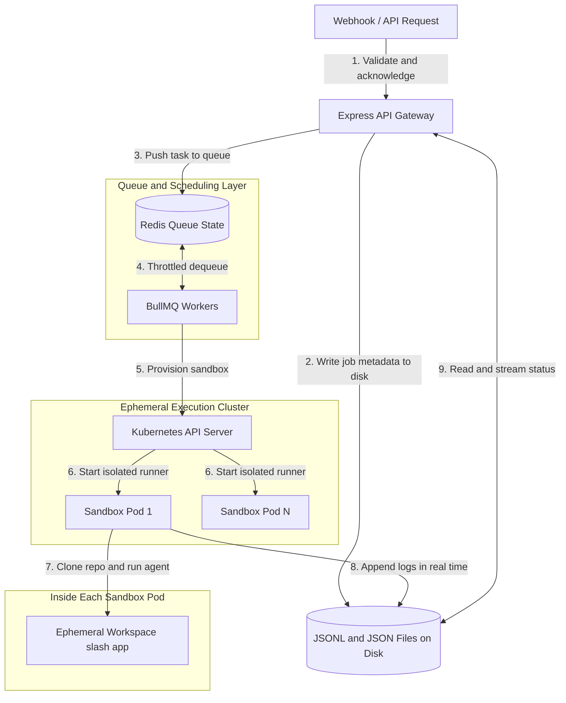

# Productionizing AI Agents: What Nobody Tells You About Scaling Coding Sandboxes

So I built an autonomous AI coding agent. It clones a repository, checks out a branch, invokes an LLM, writes some tests, runs them, and opens a pull request. It worked beautifully on my laptop.

Then I decided to launch it.

I exposed a raw Express webhook, threw a couple of parallel test requests at it, and the server locked up. The Linux Out-of-Memory killer forcefully terminated my Node process, my host filesystem got corrupted by concurrent git lock files, and my gateway threw 504 timeouts. I had to SSH in and restart everything manually.

That experience is what made me actually think about production agent architecture. Because deploying a heavy autonomous coding agent is nothing like deploying a standard API microservice. You are not scaling HTTP requests. You are scaling untrusted operating system workloads, and that requires a completely different mental model.

This is what I learned, and what I would do differently from day one.

---

## Why Simple Agent Setups Fall Apart

When you run agent shell commands directly on your bare-metal host, you are playing with fire. If the LLM writes an unsafe script or the cloned repository contains malicious install hooks, the runner has full access to your environment. It can read your secrets, delete files, or quietly install a backdoor. This is not a theoretical concern. It happens.

Beyond security, there are three operational problems that show up fast when you increase concurrency.

The first is resource exhaustion. A single agent running `npm install`, compiling TypeScript, and executing a full test suite can consume two cores and around 1.5 gigabytes of RAM. Run ten of those in parallel and a standard VM will hit CPU starvation within minutes. The system becomes unresponsive and jobs start timing out or failing silently.

The second problem is network gateway timeouts. AI agents are slow by nature. They plan, reason, write code, verify it, and sometimes loop back to fix mistakes. A single run can take ten to twenty minutes. If your HTTP connection stays open waiting for a response, your reverse proxy, whether that is Nginx, Caddy, or Cloudflare, will terminate the connection long before the agent finishes. The user sees a failed request even though the work is still running in the background.

The third problem is filesystem collisions. If two concurrent jobs try to clone or run commands in the same workspace path, Git and package managers throw lock exceptions. Both jobs crash and neither produces output.

These are not edge cases. These are the default outcomes when you skip the infrastructure layer.

---

## The Architecture That Actually Works

To handle 100 or more concurrent agent jobs without the system falling apart, you need to separate three concerns: ingestion, scheduling, and execution. None of these should be in the same synchronous request-response cycle.

Here is the system design that I arrived at:



The ingestion layer receives the webhook and returns a job ID within milliseconds. The scheduling layer manages concurrency so the cluster never gets overloaded. The execution layer runs each job in a completely isolated container that is destroyed when the work is done. And disk-based logging makes the system observable without burning memory.

---

## The Three Things You Have to Get Right

### Asynchronous Job Queuing

The single most important change you can make to a naive agent setup is to stop waiting for the agent to finish before responding to the HTTP request. Return a job ID immediately, write the initial status to disk, push the task into a queue, and close the connection. The client can poll for status updates.

This one change eliminates gateway timeouts entirely. It also gives you natural backpressure. When 100 requests arrive simultaneously, only a fixed number of jobs start running. The rest wait in Redis without consuming any CPU or memory. You control the concurrency cap, and you can tune it based on your available hardware.

BullMQ makes this straightforward to implement. You set a concurrency limit on your workers, and the library handles the rest. If a worker crashes mid-job, BullMQ automatically retries it. If you add a new worker process, it picks up from the queue without any coordination overhead.

### Ephemeral Sandbox Pods

Running agent code in an isolated container is what separates a toy from a production system. When a job starts, your worker calls the Kubernetes API to create a new Pod with a minimal base image, strict CPU and memory limits, and no access to internal cluster services.

```yaml
resources:
  limits:
    cpu: "2"
    memory: "2Gi"
  requests:
    cpu: "500m"
    memory: "512Mi"
```

Inside that Pod, the agent can clone repositories, install packages, run tests, and push commits to GitHub. It cannot reach your database, your Redis instance, or any other running Pod. When the job finishes, the worker deletes the Pod and all ephemeral state is gone. The cluster resources are immediately freed for the next job.

This model also makes horizontal scaling trivial. You can run your workers across multiple physical machines and the Kubernetes scheduler distributes the Pods automatically. Adding a new VM to the cluster adds capacity without any application-level changes.

### JSONL Logging for Real-Time Observability

Users want to know what their autonomous developer is actually doing while it runs. Returning a single summary JSON object at the end of a twenty-minute job is not acceptable.

The naive solution is to accumulate logs in memory and flush them to the response at the end. The problem is that memory grows without bound, the data is lost if the process crashes, and you still cannot serve intermediate status to polling clients.

The better approach is to write logs to disk in JSON Lines format as they happen. Each log entry is a single JSON object appended to a file. The file grows incrementally and can be read from any point. When a client polls the status endpoint, the server reads the log file, parses each line, and returns the formatted entries alongside the job metadata.

This gives you real-time observability with near-zero memory overhead and full persistence across server restarts.

---

## Isolation Tradeoffs at Different Stages

Not every project needs Kubernetes from day one. Here is an honest breakdown of the tradeoffs at each stage:

| Isolation Model | Security | Memory Cost | Startup Time | When to Use |
| :--- | :--- | :--- | :--- | :--- |
| Bare metal host | None | Negligible | Instant | Personal scripts only |
| Local Docker daemon | Medium | Low | 1 to 2 seconds | Early stage, single VM, private repos |
| Kubernetes Pods | High | Medium | 2 to 4 seconds | Production, multi-tenant, external users |

If you are running this on a single Hetzner VM with low traffic and all repositories are trusted, Docker gives you a reasonable middle ground. If you are building something where untrusted users can point the agent at arbitrary repositories, Kubernetes with tight NetworkPolicies is the only responsible choice.

---

## How Autoscaling Ties It Together

The real power of this architecture shows up when you combine the BullMQ queue depth with Kubernetes cluster autoscaling. You configure your cluster to watch the queue length and spin up additional VM nodes when the backlog exceeds a threshold. When the queue drains, the extra nodes are terminated and you stop paying for them.

This means your infrastructure cost tracks your actual usage almost perfectly. At 3am when nobody is submitting jobs, you are running minimal infrastructure. During a spike, the cluster expands automatically and contracts when the work is done.

Pre-pulling your sandbox container images on each node eliminates the startup penalty from image downloads. With a cached image, a new Pod goes from scheduled to running in under two seconds.

---

## The Honest Summary

None of this is particularly complicated once you understand why each piece exists. The queue exists because HTTP connections are fragile and agents are slow. The sandbox Pods exist because agent code is untrusted and resource-hungry. The JSONL logging exists because memory is finite and processes crash.

What makes this architecture worth building is that it composes well. You can start with a single VM running K3s and a local Redis instance, which costs almost nothing, and scale it horizontally to a multi-cloud cluster when the user base grows. The application code does not need to change. Only the infrastructure configuration scales up.

That is the version of this system I wish I had built from the beginning instead of discovering it through a series of painful production incidents.